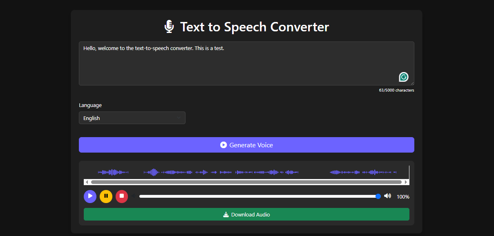

# Text-to-Speech Converter

A Flask web app that converts text to speech using Google's gTTS (Google Text-to-Speech) API.

## Features
- Convert text to speech in 30+ languages.
- Adjustable speech speed (slow/normal).
- Audio player with waveform visualization.
- Auto-cleanup of old audio files.

## Application Interface

